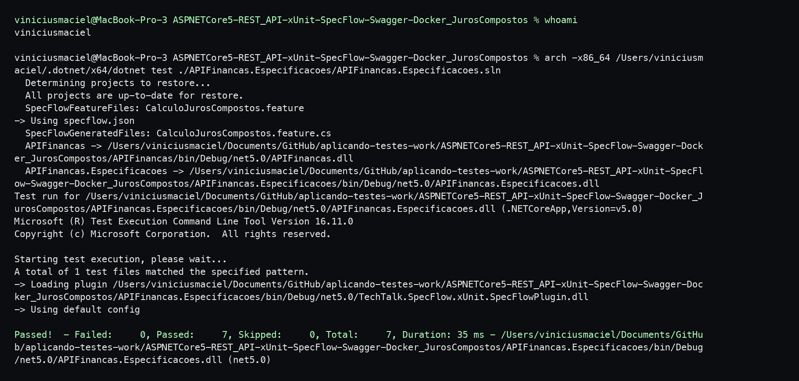

# Ponderada Testes S5

Este repositório documenta a execução de três exemplos de testes de software apresentados no tutorial de Renato Groffe sobre .NET 5.

Os códigos testados estão em forks próprios, e este README reúne os links, os cenários observados e os prints da execução no terminal local.

Tutorial base: [Testes de Software com .NET 5: exemplos de utilização](https://renatogroffe.medium.com/testes-de-software-com-net-5-exemplos-de-utiliza%C3%A7%C3%A3o-9b5514119ba2)

## Barema

(De 0 a 3) - Implementação dos 3 tipos de testes apresentados no artigo (1 ponto para cada tipo de teste implementado)

(De 0 a 2) - Explicação clara e objetiva sobre a aplicação dos testes

(De 0 a 2) - Organização do arquivo readme, com imagens dos testes e coerência dos textos.

## Repositórios utilizados

- Teste de unidade com xUnit: [viniciusmflor/DotNet5-xUnit](https://github.com/viniciusmflor/DotNet5-xUnit)
- Teste com Mock Objects usando Moq: [viniciusmflor/DotNet5-Moq-xUnit-FluentAssertions](https://github.com/viniciusmflor/DotNet5-Moq-xUnit-FluentAssertions)
- Teste BDD com SpecFlow: [viniciusmflor/ASPNETCore5-REST_API-xUnit-SpecFlow-Swagger-Docker_JurosCompostos](https://github.com/viniciusmflor/ASPNETCore5-REST_API-xUnit-SpecFlow-Swagger-Docker_JurosCompostos)

## Teste de Unidade com xUnit

O teste de unidade valida uma regra pequena e isolada da aplicação. Neste exemplo, o xUnit foi usado para conferir se a conversão de Fahrenheit para Celsius retorna os valores esperados sem depender de banco de dados, API externa ou interface.

Fork utilizado: [viniciusmflor/DotNet5-xUnit](https://github.com/viniciusmflor/DotNet5-xUnit)

Cenários de exemplo:

- Ao converter 32 °F, o resultado esperado é 0 °C.
- Ao converter 212 °F, o resultado esperado é 100 °C.

## Teste com Mock Objects usando Moq

O teste com Mock Objects simula uma dependência externa para avaliar apenas o comportamento da classe principal. Neste exemplo, o Moq substitui o serviço de consulta de crédito, enquanto o Fluent Assertions deixa as validações mais legíveis.

Fork utilizado: [viniciusmflor/DotNet5-Moq-xUnit-FluentAssertions](https://github.com/viniciusmflor/DotNet5-Moq-xUnit-FluentAssertions)

Cenários de exemplo:

- Ao consultar um CPF inválido, o status esperado é `ParametroEnvioInvalido`.
- Ao consultar um CPF sem pendências, o status esperado é `SemPendencias`.

## Teste BDD com SpecFlow

O teste BDD descreve o comportamento esperado em linguagem próxima da regra de negócio. Neste exemplo, o SpecFlow lê cenários escritos em Gherkin para validar o cálculo de juros compostos a partir de valor do empréstimo, prazo e taxa mensal.

Fork utilizado: [viniciusmflor/ASPNETCore5-REST_API-xUnit-SpecFlow-Swagger-Docker_JurosCompostos](https://github.com/viniciusmflor/ASPNETCore5-REST_API-xUnit-SpecFlow-Swagger-Docker_JurosCompostos)

Observação: o exemplo original continha uma simulação de falha no cálculo. No fork, foi aplicada a correção indicada no próprio código, arredondando o resultado para duas casas decimais antes da validação.

Cenários de exemplo:

- Empréstimo de R$ 10.000,00 por 12 meses com taxa de 2,00% ao mês deve resultar em R$ 12.682,42.
- Empréstimo de R$ 30.000,00 por 3 meses com taxa de 3,00% ao mês deve resultar em R$ 32.781,81.

