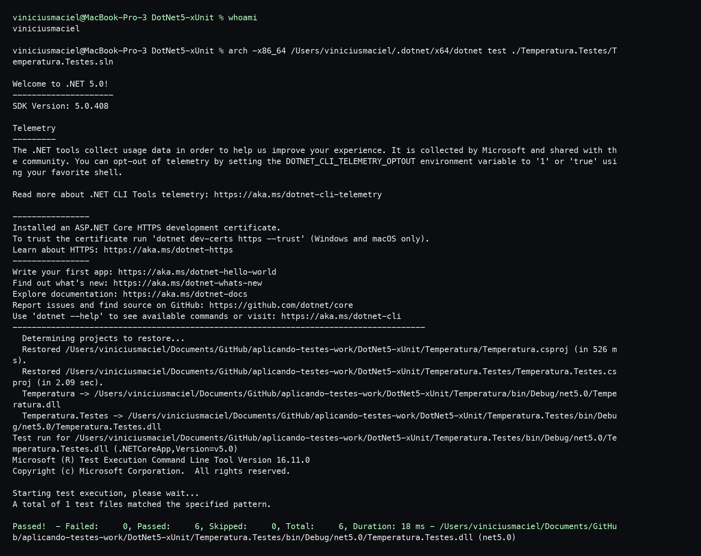
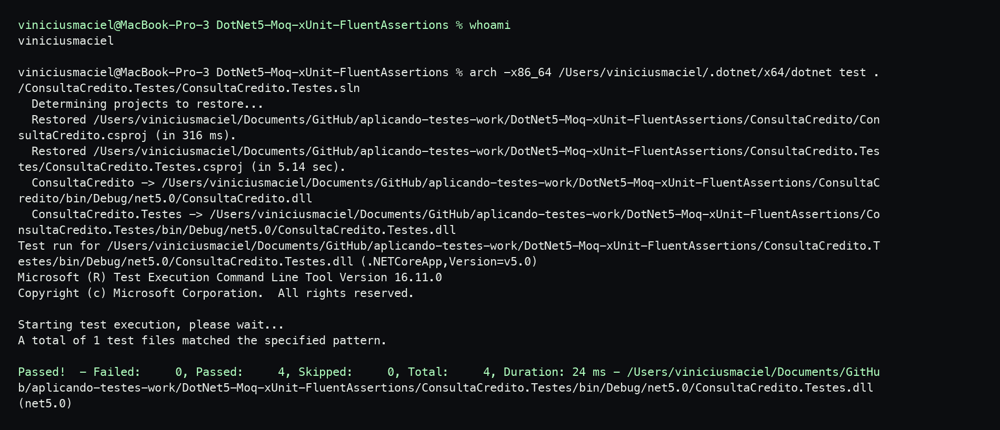

# Aplicando Testes

Este repositório documenta a execução de três exemplos de testes de software apresentados no tutorial de Renato Groffe sobre .NET 5.

Os códigos testados estão em forks próprios, e este README reúne os links, os cenários observados e os prints da execução no terminal local.

## Repositórios utilizados

- Teste de unidade com xUnit: [viniciusmflor/DotNet5-xUnit](https://github.com/viniciusmflor/DotNet5-xUnit)
- Teste com Mock Objects usando Moq: [viniciusmflor/DotNet5-Moq-xUnit-FluentAssertions](https://github.com/viniciusmflor/DotNet5-Moq-xUnit-FluentAssertions)
- Teste BDD com SpecFlow: [viniciusmflor/ASPNETCore5-REST_API-xUnit-SpecFlow-Swagger-Docker_JurosCompostos](https://github.com/viniciusmflor/ASPNETCore5-REST_API-xUnit-SpecFlow-Swagger-Docker_JurosCompostos)

## Teste de Unidade com xUnit

O teste de unidade valida uma regra pequena e isolada da aplicação. Neste exemplo, o xUnit foi usado para conferir se a conversão de Fahrenheit para Celsius retorna os valores esperados sem depender de banco de dados, API externa ou interface.

Fork utilizado: [viniciusmflor/DotNet5-xUnit](https://github.com/viniciusmflor/DotNet5-xUnit)

Cenários de exemplo:

- Ao converter 32 °F, o resultado esperado é 0 °C.
- Ao converter 212 °F, o resultado esperado é 100 °C.

## Teste com Mock Objects usando Moq

O teste com Mock Objects simula uma dependência externa para avaliar apenas o comportamento da classe principal. Neste exemplo, o Moq substitui o serviço de consulta de crédito, enquanto o Fluent Assertions deixa as validações mais legíveis.

Fork utilizado: [viniciusmflor/DotNet5-Moq-xUnit-FluentAssertions](https://github.com/viniciusmflor/DotNet5-Moq-xUnit-FluentAssertions)

Cenários de exemplo:

- Ao consultar um CPF inválido, o status esperado é `ParametroEnvioInvalido`.
- Ao consultar um CPF sem pendências, o status esperado é `SemPendencias`.

